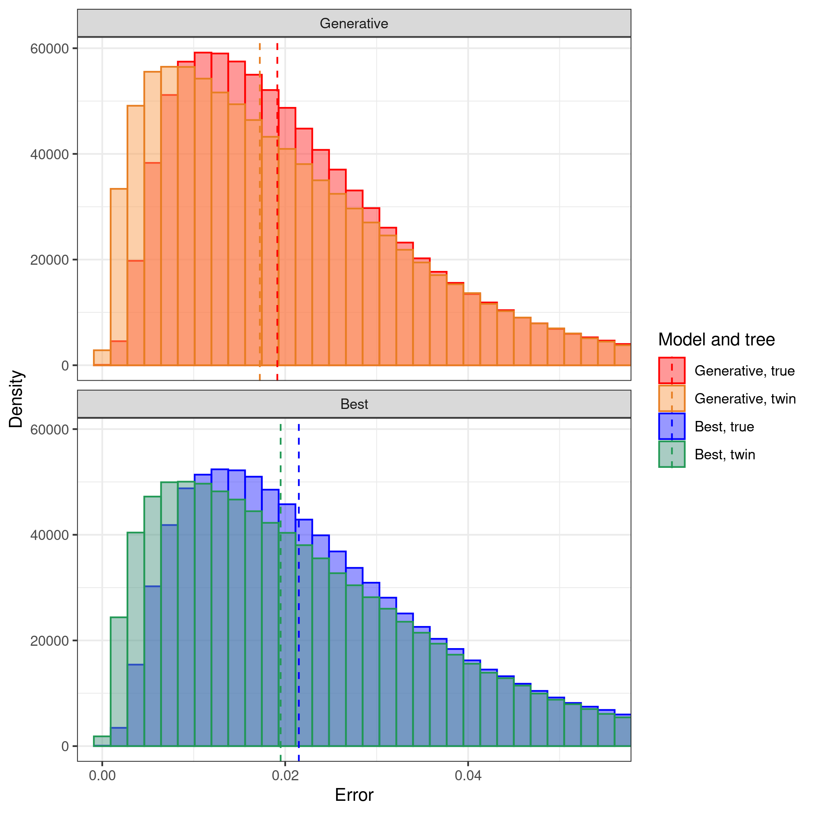

# pirouette_example_26

Branch   |                                                                                                 |                                                                                               
---------|--------------------------------------------------------------------------------------------------------------------------------------------------------------|--------------------------------------------------------------------------------------------------------------------------------------------------------------------------------------------
`master` | |
`develop`||

A [pirouette example](https://github.com/richelbilderbeek/pirouette_examples)
that shows the true and twin error for a BD tree when assuming a Yule tree prior.

## Results

 * Download the intermediate data at 
   [https://www.richelbilderbeek.nl/pirouette_example_26.zip](https://www.richelbilderbeek.nl/pirouette_example_26.zip)

